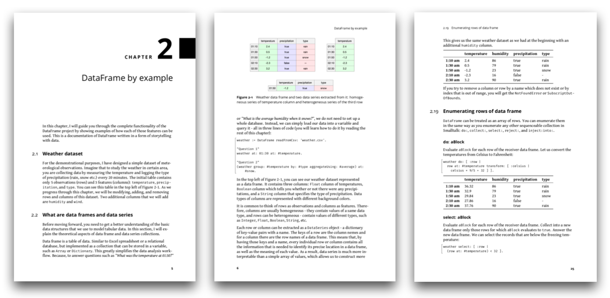

# Pharo DataFrame
[](https://travis-ci.org/PolyMathOrg/DataFrame)
[](https://ci.appveyor.com/project/olekscode/dataframe)
[](https://coveralls.io/github/PolyMathOrg/DataFrame?branch=master)
[](https://raw.githubusercontent.com/PolyMathOrg/DataFrame/master/LICENSE)
[](https://pharo.org/download)
[](https://pharo.org/download)
[](https://pharo.org/download)

DataFrame is a tabular data structure for data analysis in [Pharo](https://pharo.org/).


## What are data frames?

Data frames are the one of the essential parts of the data science toolkit. They are the specialized data structures for tabular data sets that provide us with a simple and powerful API for summarizing, cleaning, and manipulating a wealth of data sources that are currently cumbersome to use.

A data frame is like a database inside a variable. It is an object which can be created, modified, copied, serialized, debugged, inspected, and garbage collected. It allows you to communicate with your data quickly and effortlessly, using just a few lines of code. DataFrame project is similar to [pandas](https://pandas.pydata.org/) library in Python or built-in [data.frame](https://www.rdocumentation.org/packages/base/versions/3.5.3/topics/data.frame) class in R.

## Installation
To install DataFrame, go to the Playground (`Ctrl+OW`) in your fresh Pharo image and execute the following Metacello script (select it and press Do-it button or `Ctrl+D`):

```smalltalk
Metacello new
  baseline: 'DataFrame';
  repository: 'github://PolyMathOrg/DataFrame/src';
  load.
```

## Very simple example

In this section I show a very simple example of creating and manipulating a little data frame. For more advanced examples, please check the [DataFrame Booklet](#dataframe-booklet).

### Creating a data frame 

```Smalltalk
weather := DataFrame withRows: #(
  (2.4 true rain)
  (0.5 true rain)
  (-1.2 true snow)
  (-2.3 false -)
  (3.2 true rain)).
```

## DataFrame Booklet

For more information, please read [Data Analysis Made Simple with Pharo DataFrame](https://github.com/SquareBracketAssociates/Booklet-DataFrame) - a booklet that serves as the main source of documentation for the DataFrame project. It describes the complete API of DataFrame and DataSeries data structures, and provides examples for each method.

[](https://github.com/SquareBracketAssociates/Booklet-DataFrame)
